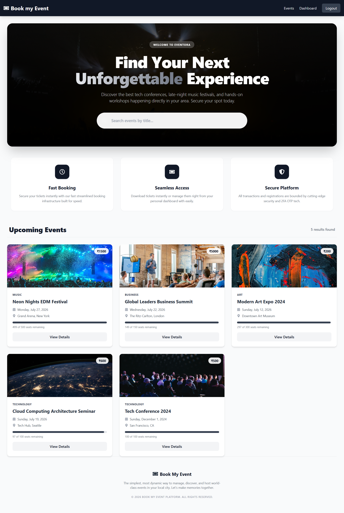
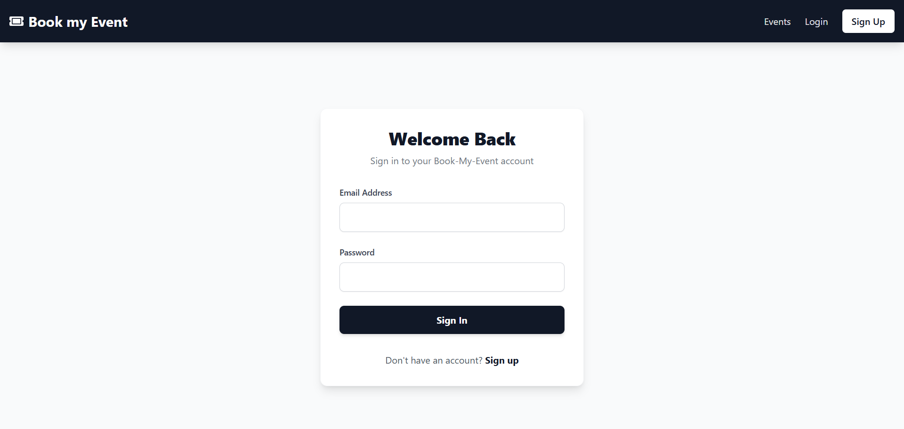
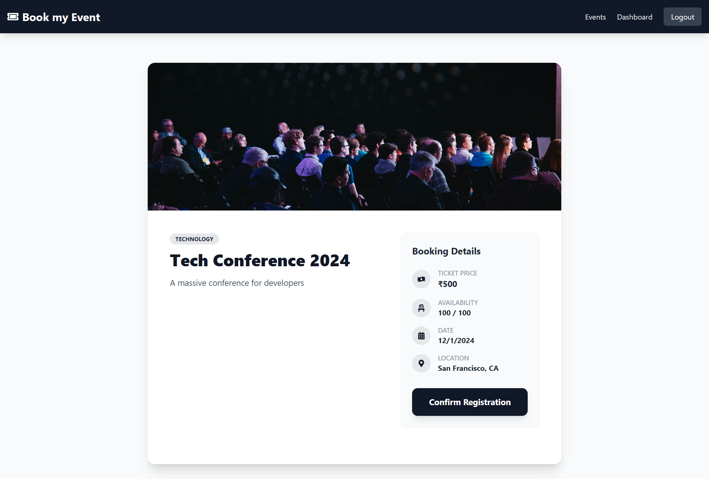
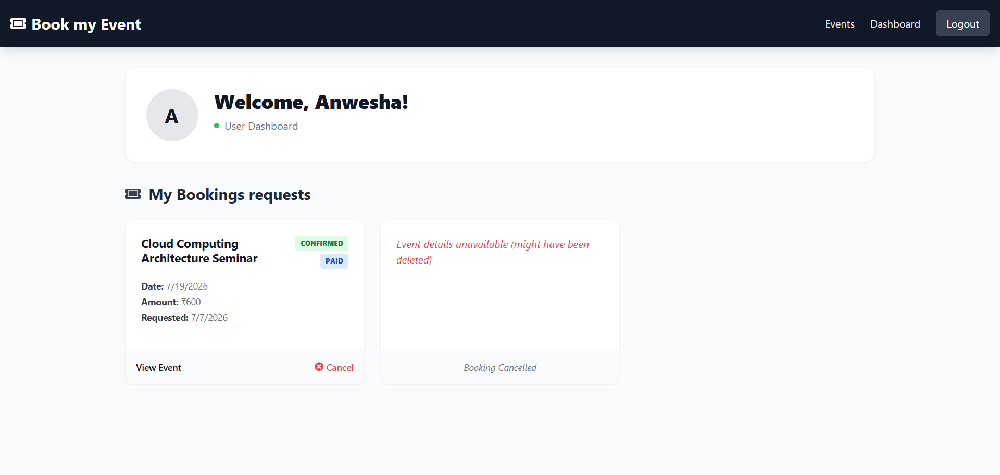
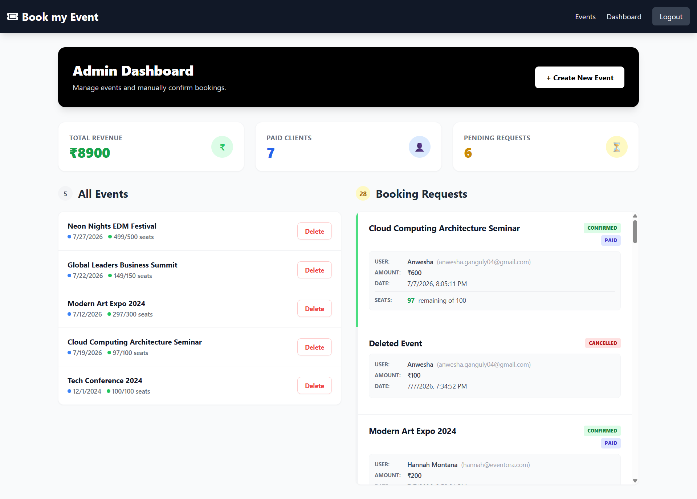

# Book Now

A full-stack MERN Event Booking Platform that enables users to browse events, securely book tickets, and manage their bookings through an intuitive interface. The application includes JWT-based authentication, OTP verification, booking management, and an admin dashboard for event management.

---

## Live Demo

**Application:**  
https://book-now-iota.vercel.app

**Source Code:**  
https://github.com/Anwesha4/book-now

---

## Tech Stack

### Frontend
- React.js
- Vite
- React Router
- Axios
- Tailwind CSS

### Backend
- Node.js
- Express.js
- MongoDB
- Mongoose
- JWT Authentication
- Nodemailer

### Deployment
- Vercel
- Render
- MongoDB Atlas

---

# Application Preview

## Home Page

Browse all available events with pricing, date, venue, and availability information.



---

## Authentication

<table>
<tr>
<td align="center">

### Login



</td>

<td align="center">

### Register


</td>
</tr>
</table>

---

## Event Details

View complete information about an event before booking.



---

## Dashboards

<table>
<tr>
<td align="center">

### User Dashboard



</td>

<td align="center">

### Admin Dashboard



</td>
</tr>
</table>

---

# Features

### User

- User Registration
- Secure Login using JWT Authentication
- Browse Available Events
- View Event Details
- Book Event Tickets
- OTP Verification
- Booking Confirmation
- User Dashboard
- Responsive Design

### Admin

- Admin Authentication
- Create Events
- Manage Events
- View Bookings

---

# Project Structure

```text
book-now
│
├── assets
│   ├── home.png
│   ├── login.png
│   ├── signUp.png
│   ├── event.png
│   ├── user-dashboard.png
│   └── admin-dashboard.png
│
├── client
│   ├── src
│   ├── public
│   └── package.json
│
├── server
│   ├── controllers
│   ├── middleware
│   ├── models
│   ├── routes
│   ├── utils
│   └── package.json
│
└── README.md
```

---

# Installation

## Clone the repository

```bash
git clone https://github.com/Anwesha4/book-now.git
```

```bash
cd book-now
```

---

## Backend Setup

```bash
cd server
npm install
```

Create a `.env` file inside the `server` folder.

```env
PORT=5000
MONGODB_URI=your_mongodb_uri
EMAIL_USER=your_email
EMAIL_PASS=your_app_password
JWT_SECRET=your_secret
```

Run the backend server.

```bash
npm run dev
```

---

## Frontend Setup

```bash
cd client
npm install
```

Create a `.env` file.

```env
VITE_API_URL=http://localhost:5000
```

Run the frontend.

```bash
npm run dev
```

---

# API Endpoints

## Authentication

- POST `/api/auth/register`
- POST `/api/auth/login`
- POST `/api/auth/send-otp`
- POST `/api/auth/verify-otp`

## Events

- GET `/api/events`
- GET `/api/events/:id`

## Bookings

- POST `/api/bookings`
- GET `/api/bookings/user`

---

# Authentication

- JWT-based Authentication
- Protected Routes
- Authorization Middleware

---

# Deployment

| Service | Platform |
|---------|----------|
| Frontend | Vercel |
| Backend | Render |
| Database | MongoDB Atlas |

---

# Known Issue

The deployed application may occasionally experience OTP email delivery issues because Gmail SMTP connections can time out on the hosting platform. The feature works correctly in local development. Migrating to a dedicated email provider such as Resend is planned.

---

# Future Improvements

- Payment Gateway Integration
- Search & Filter Events
- Event Categories
- Seat Selection
- Email Service Migration (Resend)
- User Profile Management
- Event Image Uploads
- Pagination

---

# Author

**Anwesha Ganguly**

GitHub: https://github.com/Anwesha4

